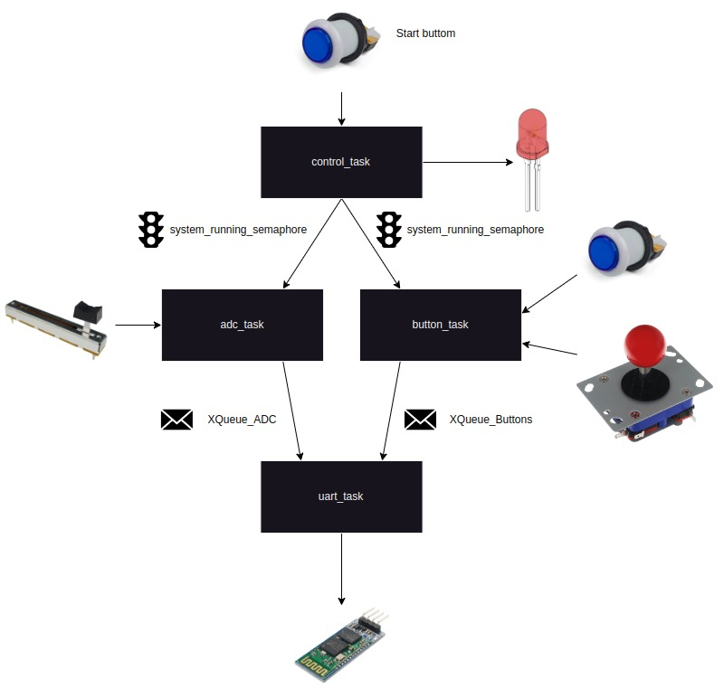

# Diagrama de Blocos



# HC06 examplo

Conectar HC06 no 5V e gnd, pino TX no `GP5` e pino RX no `GP4`. Também é necessário conectar o pino `STATE` do bluetooth no pino `GP3`.

O projeto está organizado da seguinte maneira:

- `hc06.h`: Arquivo de headfile com configurações do HC06, tais como pinos, uart, ..
- `hc06.c`: Arquivo `.c` com implementação das funções auxiliares para configurar o módulo bluetooth
    - `bool hc06_check_connection();`
    - `bool hc06_set_name(char name[]);`
    - `bool hc06_set_pin(char pin[]);`
    - `bool hc06_set_at_mode(int on);`
    - `bool hc06_init(char name[], char pin[]);`

- `main.c` Arquivo principal com inicialização do módulo bluetooth

```c
void hc06_task(void *p) {
    uart_init(HC06_UART_ID, HC06_BAUD_RATE);
    gpio_set_function(HC06_TX_PIN, GPIO_FUNC_UART);
    gpio_set_function(HC06_RX_PIN, GPIO_FUNC_UART);
    hc06_init("aps2_legal", "1234");

    while (true) {
        uart_puts(HC06_UART_ID, "OLAAA ");
        vTaskDelay(pdMS_TO_TICKS(100));
    }
}
```

Extra ao que foi feito em sala de aula, eu adicionei o `hc06_set_at_mode` que força o módulo bluetooth entrar em modo `AT`, caso contrário ele fica 
conectado no equipamento e não recebe mais comandos.

## No linux

Para conectar o bluetooth no linux usar os passos descritos no site:

- https://marcqueiroz.wordpress.com/aventuras-com-arduino/configurando-hc-06-bluetooth-module-device-no-ubuntu-12-04/
